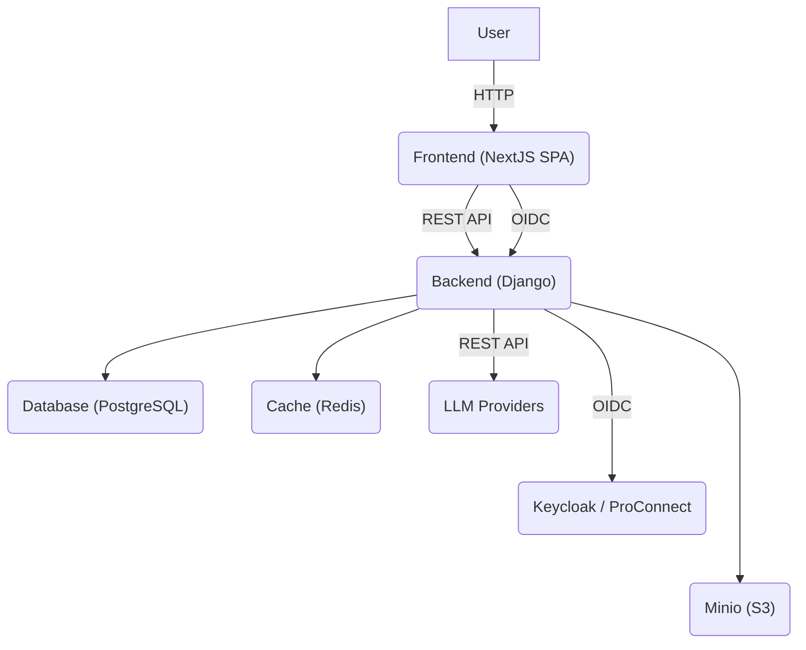

## Architecture

### Global system architecture

```mermaid
flowchart TD
    User -- HTTP --> Front("Frontend (NextJS SPA)")
    Front -- REST API --> Back("Backend (Django)")
    Front -- OIDC --> Back -- OIDC ---> OIDC("Keycloak / ProConnect")
    Back --> DB("Database (PostgreSQL)")
    Back --> Cache("Cache (Redis)")
    Back ----> S3("Minio (S3)")
    Back -- REST API --> LLM("LLM Providers")
```
