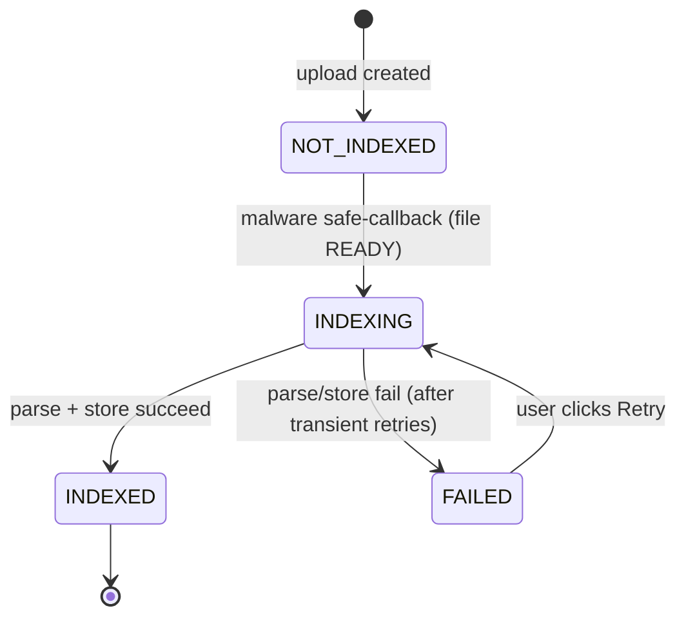

# Project File Indexing

This document describes the **project file indexing** lifecycle: how a file uploaded to a project's library is parsed and stored in the RAG backend so it becomes searchable from every conversation in the project, and how the system behaves when that indexing is slow, fails, or needs retrying.

It focuses on the runtime lifecycle - the state machine, the async task, the two retry layers, failure observability, and the frontend UX. For the surrounding storage details (the RAG collection, the markdown companion cache, deletion cleanup), see [Attachments](attachments.md#project-attachments). For the background-task mechanics, see [Celery](celery.md).

## Table of Contents

- [Why project files are indexed asynchronously](#why-project-files-are-indexed-asynchronously)
- [The `index_state` lifecycle](#the-index_state-lifecycle)
- [End-to-end flow](#end-to-end-flow)
- [The indexer](#the-indexer)
- [Retry layer 1: automatic transient retry](#retry-layer-1-automatic-transient-retry)
- [Retry layer 2: user-initiated retry](#retry-layer-2-user-initiated-retry)
- [Failure handling and observability](#failure-handling-and-observability)
- [Frontend UX](#frontend-ux)
- [Settings](#settings)
- [Related documentation](#related-documentation)

---

## Why project files are indexed asynchronously

Conversation attachments are indexed **lazily** - on the first chat turn that builds RAG context. Project files can't follow that pattern: any conversation in the project may be the first to ask about a file, so they must be searchable immediately, before any conversation is even opened.

Parsing an untrusted upload (PDF, DOCX, ODT, ...) is also the riskiest in-process work in the app - a malformed or hostile file can make the parser loop, hang, or balloon memory. Doing it inline in the upload request would block the response and expose the web process to that risk.

The solution: index **at upload time, on a Celery worker**. The malware safe-callback enqueues a background task once the file is marked `READY`; the heavy parse/store runs off the request path, bounded by Celery task time limits (see [Worker resource limits](attachments.md#worker-resource-limits)). The attachment tracks its own progress through the `index_state` field so the API and UI can reflect it.

---

## The `index_state` lifecycle

Project attachments carry an `index_state` field (`chat.enums.AttachmentIndexState`) that tracks a single file's journey into the RAG backend. It is distinct from the conversation-level collection state.

| State | Value | Meaning |
|---|---|---|
| `NOT_INDEXED` | `not_indexed` | Default; not yet sent to the backend. |
| `INDEXING` | `indexing` | The indexing task is running (or enqueued). |
| `INDEXED` | `indexed` | Stored in the backend; `rag_document_id` is set. |
| `FAILED` | `failed` | The last attempt failed; `processing_error` carries the reason. |



`FAILED` is **terminal until a manual re-index** - nothing retries it automatically once the in-task retries are exhausted (see the two retry layers below). The file itself stays `READY` and downloadable throughout; a failed index only means the file is not searchable via RAG, not that it is lost.

`index_state` is exposed on the attachment API (`ChatConversationAttachmentSerializer`, read-only). `processing_error` is **not** exposed to the client today - the frontend knows a file failed, not why; the reason lives in the DB row and the logs.

---

## End-to-end flow

```
upload ──> upload-ended ──> MIME detect ──> malware scan
                                                  │ safe
                                                  ▼
                        project_safe_attachment_callback
                          1. mark file READY
                          2. set index_state = INDEXING   (closes the send-gate race)
                          3. enqueue index_project_attachment_task(id)
                                                  │
                                                  ▼ (Celery worker)
                        index_project_attachment(attachment)
                          ensure collection ─> parse+store (with retry) ─> record id
                                                  │
                            ┌─────────────────────┴─────────────────────┐
                            ▼                                           ▼
                    INDEXED + rag_document_id                   FAILED + processing_error
                    + markdown companion                        (logged, never raised)
```

Step 2 (setting `INDEXING` **before** the worker picks up the task) is deliberate: it closes the brief enqueue window in which a message sent right after upload could see the file as not-yet-indexing and answer without its content. The send-gate keys off `INDEXING` (see [Frontend UX](#frontend-ux)).

The Celery task (`chat.tasks.index_project_attachment_task`) is a thin wrapper: it resolves the row with `select_related("project", "uploaded_by")`, skips silently if the row was deleted meanwhile, and delegates to `chat.agent_rag.indexing.index_project_attachment`.

---

## The indexer

`index_project_attachment(attachment)` is a one-shot, **idempotent** indexer. In order it:

1. **Skips non-indexable rows** (`is_indexable_for_rag`): not `READY`, no content type, images, or markdown companions (`conversion_from` set).
2. **Reconciles already-indexed rows**: a non-empty `rag_document_id` means the chunks already exist in the backend, so it returns without re-parsing. This makes the task safe to invoke more than once (e.g. a malware backend that redelivers safe-callbacks). On this path it also **self-heals a missing markdown companion** - if a prior run stored the chunks but failed before writing the companion, it re-parses (no re-store, so no duplicate chunks) and recreates it.
3. **Sets `INDEXING`**, then within a guarded block:
   - Lazily creates the project's RAG collection under `select_for_update` (`_ensure_project_collection`).
   - Reads the file from object storage and calls `parse_and_store_document` **through the retry helper** (see below).
   - **Fails fast on a missing document id** - the `INDEXED` transition and the idempotency guard both key off `rag_document_id`, so a falsy id would wedge the row in `INDEXING`; routing through the failure path keeps it visible and retryable instead.
   - Persists `rag_document_id` and flips to `INDEXED` **before** the companion side-effects, so a later companion failure can't cause a re-index that duplicates chunks.
   - Writes the hidden markdown companion for non-text inputs (see [Markdown companion attachment](attachments.md#markdown-companion-attachment)).

On any exception the row lands `FAILED` with `processing_error` set; the error is logged, never raised.

---

## Retry layer 1: automatic transient retry

The Albert RAG API is intermittently flaky. Rather than a blanket Celery autoretry (which re-runs the whole task for every failure class), the retry is scoped to just the flaky call.

`_parse_and_store_with_retry` wraps the `parse_and_store_document` call and retries **only transient failures**, controlled by two settings:

- `RAG_STORE_MAX_ATTEMPTS` (default `2` - one initial attempt + one retry; set to `1` to disable).
- `RAG_STORE_RETRY_DELAY_SECONDS` (default `3`) - a blocking `time.sleep` between attempts.

What counts as transient (`_is_transient_rag_error`):

| Error | Retried? | Rationale |
|---|---|---|
| `ConnectionError`, `Timeout` | ✅ | Network blip. |
| `HTTPError` with status `5xx` or `429` | ✅ | Server error / rate limit - likely to clear. |
| `HTTPError` with status `4xx` | ❌ | Bad request / auth / file too large - permanent for this input. |
| `AlbertMissingDocumentIdError` | ❌ | The chunks were already stored; retrying would **duplicate** them. |

Each retry is logged at `WARNING`. If the last attempt still fails (or the error is non-transient), it propagates to the `FAILED` path.

> The delay is a **blocking sleep on the worker** - it holds a worker slot for its duration. That's an accepted trade-off for a short delay on a background task; it keeps the retry local and idempotency-safe, instead of re-running the whole task via a Celery countdown.

---

## Retry layer 2: user-initiated retry

Once the in-task retries are exhausted, `FAILED` is terminal until someone asks for a re-index. The user does this from the chat composer (see [Frontend UX](#frontend-ux)); it calls a dedicated endpoint:

**`POST /api/v1.0/projects/{project_id}/attachments/{attachment_id}/reindex/`** (`ChatProjectAttachmentViewSet.reindex`)

- Rejects with **400** if `index_state` is not `FAILED` (`"Only files whose indexing failed can be re-indexed."`) - you can't re-enqueue a file that is already indexing or indexed.
- Otherwise sets `index_state = INDEXING`, clears `processing_error`, and re-enqueues `index_project_attachment_task`.
- Returns the updated attachment (200).

Because the indexer is idempotent, a retry after a partial success (chunks stored but a later step failed) takes the reconcile path and completes without duplicating chunks.

---

## Failure handling and observability

When indexing finally fails, the terminal `except` in `index_project_attachment`:

- Logs at **ERROR** via `logger.exception`, so the **full traceback** is captured (and forwarded to **Sentry** when `SENTRY_DSN` is set - the SDK's default logging integration captures ERROR logs as events).
- Includes the **file identity** in the message: attachment id, `file_name`, `content_type`, and project id.
- Captures the **Albert response body** through `_albert_error_detail`: for an `HTTPError`, `str(exc)` is generic (`"500 Server Error ... for url ..."`) and hides the actual reason, so the helper surfaces `HTTP <status>: <response body>` (truncated to 2000 chars). For non-HTTP errors it falls back to `str(exc)`.
- Persists that same detail into `processing_error`, so the reason is queryable on the row.

Net: on a terminal failure you get a traceback, the file identity, the real Albert error payload, a Sentry event, and a persisted reason - plus a `WARNING` line per transient retry that preceded it.

---

## Frontend UX

The chat composer reflects project indexing state so a user never unknowingly asks about a file that isn't searchable yet.

**Polling.** `useProjectAttachments(projectId)` polls the attachment list (`refetchInterval`) every 3s **while any file is `indexing`**, and stops once nothing is indexing. `Chat.tsx` derives the active project id from the conversation (or the pending new-chat project) and feeds the state into `InputChat`.

**Send-gate (indexing in progress).** While any project file is `indexing`, a banner shows *"Processing project files. You can send a message once indexing is done."* and sending is blocked - the file's content isn't searchable yet, so a message now would get an answer that ignores it.

**Failed banner (with retry).** When one or more files are `failed` (and none are currently indexing), a banner shows *"N project file(s) failed to index and are not searchable."* with a **Retry** button. Retry fires the reindex endpoint for **all** failed files in a single mutation (`Promise.all`), so the button stays disabled until the whole batch settles; partial success reconciles on the next refetch. The suggestion carousel is suppressed while this banner is shown, consistent with the other composer banners.

Both banners are shown on **every conversation in the project**, not just the project landing screen - the active project is resolved from the opened conversation's `project` (nested on the retrieve endpoint) as well as the pending new-chat project.

---

## Settings

| Setting | Default | Description |
|---|---|---|
| `RAG_STORE_MAX_ATTEMPTS` | `2` | Total store attempts (initial + retries) on transient Albert failures. `1` disables retrying. |
| `RAG_STORE_RETRY_DELAY_SECONDS` | `3` | Seconds the worker sleeps between store attempts. Blocks a worker slot for the duration. |
| `RAG_DOCUMENT_PARSER` | `AlbertParser` | Import path of the parser that converts uploads to Markdown. |
| `RAG_DOCUMENT_SEARCH_BACKEND` | `AlbertRagBackend` | Import path of the vector-search backend used for indexing and search. |
| `PROJECT_FILES_MAX_COUNT` | `10` | Max non-image attachments per project (excludes companions). |
| `CELERY_TASK_SOFT_TIME_LIMIT` | `180` | Graceful, catchable time limit; a slow parse ends as a recorded `FAILED`. |
| `CELERY_TASK_TIME_LIMIT` | `300` | Hard backstop; SIGKILLs a wedged worker child. Keep `hard > soft`. |

See [Attachments configuration](attachments.md#configuration) for the full attachment/RAG settings table, and [Celery settings](celery.md#settings) for broker/queue configuration.

---

## Related documentation

- [Attachments](attachments.md) - storage, RAG collection, markdown companion, deletion lifecycle, RAG search
- [Celery](celery.md) - background task mechanics (broker, worker, no result backend)
- [LLM Configuration](llm-configuration.md) - parser/backend and model settings
- [Architecture](architecture.md) - system overview
